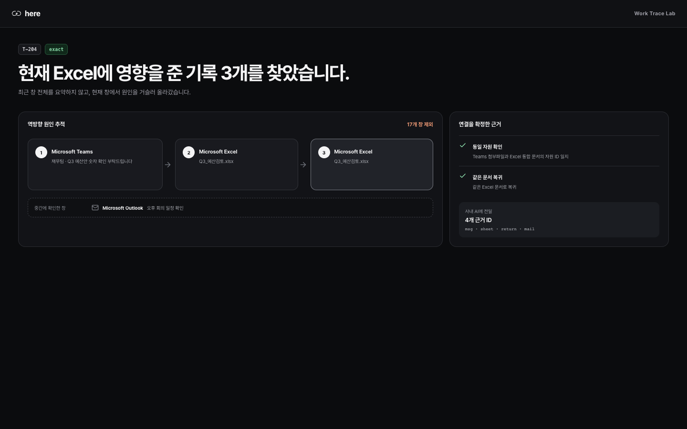

# Here — SK 그룹 해커톤 제출 메모

- AI Idea 리그 제출 원고: [AI_IDEA_LEAGUE.md](AI_IDEA_LEAGUE.md)
- 제품 페이지: https://stpcoder.github.io/here-context-recall/
- 60초 빠른 시작: https://stpcoder.github.io/here-context-recall/manual/

## 한 줄

**창으로 돌아오면, 이전의 내가 하던 이유와 다음 할 일을 인수인계합니다.**

## 문제

직장인은 파일·메신저·메일·회의 알림 사이를 계속 오갑니다. 비용이 큰 순간은 다시 현재 창으로 돌아와 “내가 이걸 왜 열었지?”라고 멈추는 몇 초입니다.

AX가 확산될수록 구성원이 오가는 업무 시스템과 AI 작업 창은 더 많아집니다. 각 도구에는 결과가 남지만, 왜 이동했고 어디까지 일했는지는 개인의 기억에 남습니다. 이때 생기는 다음 병목은 업무 복귀입니다.

## 해결

Here는 업무 중단을 잠시 뒤의 나에게 보내는 짧은 인수인계로 바꿉니다. 사용자가 허용한 뒤 실제 포그라운드 창 전환을 최근 10분만 로컬 메모리에 보관합니다. `Ctrl+Shift+Space` 또는 플로팅 버블을 누르면 `이 창을 열기 전 → 이 창을 처음 열음 → 다른 창을 본 동안 → 지금 복귀` 순서로 근거를 보여주고, 이어서 할 행동 한 줄을 붙입니다. 퇴근 직전 `Ctrl+Shift+M`을 누르면 그 지점만 암호화해 저장하고, 다음 날 첫 복원에서 그대로 돌아옵니다.

- 현재 창을 열기 전부터 처음 연 순간까지의 실제 사용 기록
- 원래 창 → 다른 앱들 → 현재 창 복귀로 이어진 시간순 기록
- 다시 시작할 작업 대상과 관측 범위를 넘지 않는 다음 행동 한 줄
- 선택 시 사내 vLLM/OpenAI-compatible endpoint 또는 gcloud 기반 Vertex Gemini 3.5 Flash가 같은 근거를 자연어로 요약
- 사용자가 켠 경우에만 복원 순간의 활성 창 한 장을 VLM 보조 자료로 사용

Here는 **지금 열린 창에 온 이유를 한 번에 되찾는 인터페이스**입니다.

## 기술 Wow — 업무용 분산 추적

Here의 Work Trace 엔진은 활성 창 기록을 Span으로 바꾸고, 연결된 기록에 같은 Trace ID를 붙입니다. Teams에서 실행한 파일과 Excel 문서가 같은 자원으로 확인되면 같은 업무 ID를 사용하고, Outlook 회의 일정은 별도 업무로 분리합니다. Excel로 돌아오면 동일 문서 복귀가 원래 업무 ID를 다시 활성화합니다.

사용자가 Here를 누르면 현재 Excel부터 부모 관계를 거꾸로 따라가 최초 요청을 찾습니다. 20개 창을 준비한 자동 테스트에서는 `Teams 요청 → Excel 파일 → Excel 복귀` 3개를 선택하고 관련 없는 창 17개를 제외합니다. 모델은 선택 작업 뒤에 실행되며, 실제 근거 ID 밖의 사건을 설명에 추가할 수 없습니다.

## 78초 제출 영상

제출 영상은 안전한 예시 데이터와 실제 React 상호작용으로 제품 경험을 보여줍니다. Playwright가 모든 화면 전환과 버튼 클릭을 수행하며 커서 이동도 함께 녹화합니다.

- **0–5초:** 복잡한 업무용 PC에서 하던 일을 다시 찾아주는 Here를 소개합니다.
- **8–27초:** 재무팀의 6월 실제 인건비 확인 요청에 답장하고 전달받은 Excel 파일을 엽니다.
- **27–45초:** 실제 인건비를 확인하던 중 Outlook 회의 알림으로 이동했다가 Excel로 돌아옵니다.
- **45–52초:** 파일을 연 이유와 출처가 바로 떠오르지 않는 순간을 보여줍니다.
- **52–63초:** Here가 Teams → Excel → Outlook → Excel의 시간순 근거와 확인할 위치 D6을 보여줍니다.
- **63–70초:** 사용자가 `인건비 실제값으로 이동`을 누르고 값 126이 선택됩니다.
- **70–78초:** `잠시 멈춘 업무를 다시 이어드립니다.`라는 메시지로 마무리합니다.

영상 파일은 `qa/video/here-sk-ai-hackathon-demo.mp4`, 전체 장면 검토 이미지는 `qa/screenshots/demo-contact-sheet.png`에 있습니다. Windows 포그라운드 창 수집과 사내 LLM 연결은 패키지 앱의 라이브 데모에서 별도로 검증합니다.

## 90초 라이브 데모

사전 준비: Windows에서 Here를 실행하고 캡처 동의를 켭니다. 메모장에 `분기 리포트 확인` 같은 무해한 제목의 문서를 두 개 준비합니다. 실제 업무 문서나 민감한 메신저는 사용하지 않습니다.

**0–10초**
“파일로 돌아왔는데, 왜 열었는지 순간 비는 경험이 있습니다.” Here의 작은 플로팅 버블과 `Ctrl+Shift+Space`를 보여줍니다.

**10–35초**
실제 메모장 문서 A를 열고, 브라우저나 다른 메모장 문서로 잠시 전환한 뒤, 다시 A로 돌아옵니다. 이는 스크립트된 UI가 아니라 OS의 실제 활성 창 전환입니다.

**35–55초**
현재 A에서 `Ctrl+Shift+Space`를 누릅니다. Here 패널이 A를 연 이유와 `열기까지 · 자리를 비운 동안 · 현재` 세 구간만 보여줍니다.
“중단 전후의 창을 확인하고, 바로 다음 행동으로 돌아갑니다.”

**55–70초**
제품 화면에서 파일을 연 이유와 사용한 창, 다음 행동을 확인합니다.

**70–84초**
Work Trace 검증 화면으로 전환합니다. “20개 창 중 현재 Excel의 원인 3개를 선택했고, 17개는 제외했습니다. 같은 파일과 정확한 복귀가 확인된 기록만 사내 AI에 전달됩니다.”라고 설명합니다.

**84–90초**
사내 OpenAI-compatible vLLM 연결 상태를 보여주고 “잊어도, 일은 끊기지 않게. Here.”로 마무리합니다.

## 신뢰 설계

| 구분 | Here의 실제 범위 |
| --- | --- |
| 캡처 | 활성 앱 이름, 창 제목, 프로세스, 창 경계, 전환 시각 |
| 미수집 | 키·클릭·클립보드·파일 내용·셀 값·URL·상시 스크린샷 |
| 이미지 | 기본 꺼짐. 사용자가 켜고 복원/기억을 직접 실행한 순간의 활성 창 한 장만 사용 |
| 자동 저장 | 최근 10분 기본값의 프로세스 메모리. 종료/지우기 시 제거 |
| 명시적 저장 | 선택된 근거와 선택적 이미지. OS 암호화, 최대 12개·7일 |
| 제어 | 명시적 동의, pause/resume, 보존 시간, 앱 제외, 기록 지우기 |
| 모델 | 선택 사항. 사내 OpenAI-compatible vLLM이 실제 근거만 요약하며 실패 시 로컬 창 기록 유지 |

창 제목 기록은 사용자가 앱 안에서 명시적으로 동의한 뒤에만 시작되며, 비밀번호 관리자는 기본 제외합니다. 사용자는 설정에서 민감 앱을 더 제외할 수 있습니다. Windows에서는 일반 활성 창 정보에 별도 OS 권한 팝업이 없으므로 앱 내 동의가 중요합니다. 관리자 권한 또는 보호된 창은 관측되지 않을 수 있습니다.

## 구현 가능성

- Windows Electron 앱: 실제 활성 창 확인, 전역 단축키, 플로팅 버튼, 트레이 메뉴
- 작업 구간 판정: `같은 창 → 다른 창 → 같은 창`이 관측된 경우에만 중단과 복귀로 표시
- Work Trace PoC: Window Span, Trace ID, 동일 자원·정확한 복귀 증거, 현재 창 기준 역방향 선택, 제외된 창 집계
- 사내 AI 연결: Base URL + Model ID + Bearer token으로 실제 `/chat/completions`와 Here 응답 형식을 검사하며 token은 OS 보호 저장소에 암호화
- Vertex QA: 로컬 Mac 품질 검증용. `gcloud` 로그인과 현재 프로젝트로 `gemini-3.5-flash:generateContent`를 호출
- 장시간 뒤 복귀: 사용자가 저장한 작업만 OS 보호 저장소에 전체 암호화하고 재시작 뒤 복원
- 보안 경계: 화면을 그리는 프로세스에는 Node 권한·token·직접 네트워크 권한 없음
- 배포: `main` push마다 GitHub Actions가 Windows NSIS/portable와 macOS DMG를 빌드하고 고정 Release URL 갱신

## 제출용 문구

### Title

Here — Why was I here?

### Tagline

잊어도, 일은 끊기지 않게.

### Description

Here는 잠깐 다른 일을 보고 현재 창으로 돌아왔을 때, 그 창을 열기 전부터 다시 돌아온 순간까지 실제 사용 기록을 보여주는 Windows 데스크톱 앱입니다. 사내 OpenAI-compatible vLLM을 연결하면 관련된 창을 바탕으로 하던 일과 다음 행동을 한 문장으로 정리합니다. 키 입력, 클릭, 파일 본문은 수집하지 않으며 사용자가 기록을 멈추거나 바로 지울 수 있습니다.

## 심사 시 정직하게 말할 한계

현재 패키지 앱은 활성 창과 제목, 사용 시각을 수집하고 정확한 문서 복귀를 판정합니다. Work Trace 그래프와 역방향 선택 엔진은 TypeScript로 구현했으며 `20개 기록 중 원인 3개 선택·17개 제외` 테스트를 자동으로 실행합니다. Teams에서 실행한 첨부파일과 새 Excel 문서를 동일 자원으로 연결하는 UI Automation 수집기, Excel 시트·셀 주소를 전달하는 Office 어댑터는 다음 네이티브 구현 단계입니다. 해당 어댑터가 없을 때는 제목만으로 선택한 결과를 AI 입력 축소에 사용하지 않으며, 요청 문장과 셀 위치도 확정 값으로 표시하지 않습니다.
