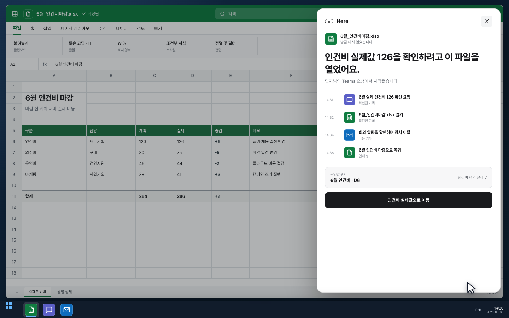
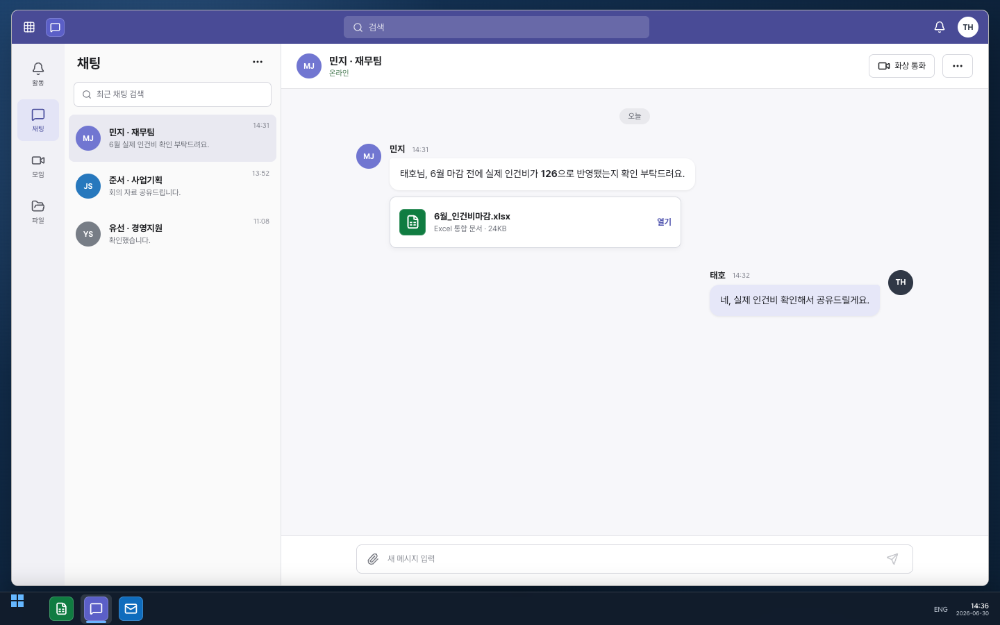
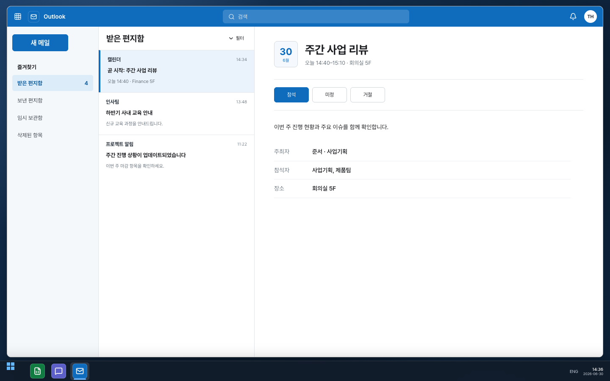
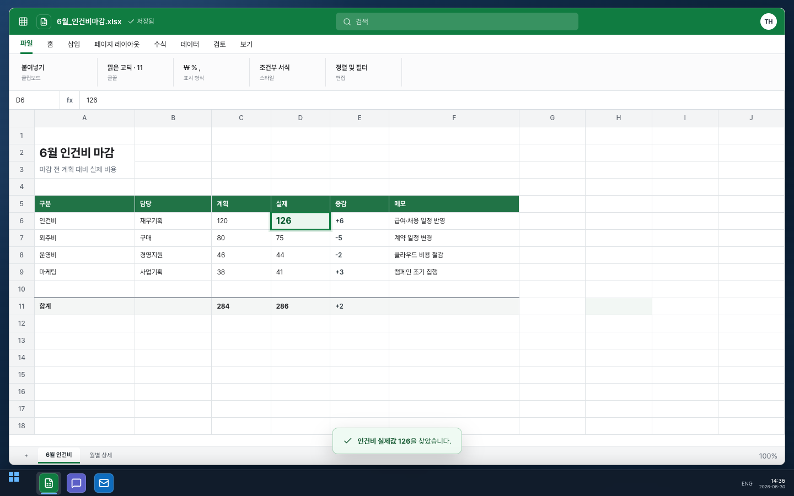

<p align="center">
  <a href="https://stpcoder.github.io/here-context-recall/">
    
  </a>
</p>

<h1 align="center">Here</h1>

<p align="center">
  <strong>창으로 돌아오면, 이전의 내가 인수인계를 시작합니다.</strong><br />
  왜 이 파일을 열었는지, 어디까지 확인했는지, 다음에 무엇을 해야 하는지 알려드립니다.
</p>

<p align="center">
  <a href="https://stpcoder.github.io/here-context-recall/"><strong>제품 소개</strong></a>
  &nbsp;&nbsp;·&nbsp;&nbsp;
  <a href="https://stpcoder.github.io/here-context-recall/#demo"><strong>데모 영상</strong></a>
  &nbsp;&nbsp;·&nbsp;&nbsp;
  <a href="https://github.com/stpcoder/here-context-recall/releases/download/latest-build/Here-Windows-x64-Setup.exe"><strong>Windows용 다운로드</strong></a>
  &nbsp;&nbsp;·&nbsp;&nbsp;
  <a href="https://stpcoder.github.io/here-context-recall/manual/"><strong>사용 안내</strong></a>
</p>

<p align="center">
  <a href="https://github.com/stpcoder/here-context-recall/actions/workflows/build-desktop.yml"></a>
  <a href="https://github.com/stpcoder/here-context-recall/actions/workflows/deploy-site.yml"></a>
</p>

<p align="center">
  <a href="https://stpcoder.github.io/here-context-recall/#demo">
    
  </a>
</p>

## 잠시 전의 내가 남기는 업무 인수인계

재무팀에서 6월 마감 전 실제 인건비를 확인해 달라는 메시지가 왔습니다. Excel 파일을 열어 값을 찾던 중 Outlook 회의 알림을 확인했고, 잠시 뒤 같은 파일로 돌아왔습니다. 파일은 그대로 열려 있지만 누구의 요청이었는지, 어디까지 봤는지, 다음에 무엇을 해야 하는지가 바로 떠오르지 않습니다.

Here 버튼을 누르면 다음과 같이 알려드립니다.

> **인건비 실제값 126을 확인하려고 이 파일을 열었어요.**<br />
> 민지님의 Teams 요청에서 시작됐습니다.<br />
> 다음 할 일은 6월 인건비 시트 D6의 실제값 확인입니다.

사람과 사람 사이의 인수인계에는 일을 시작한 이유와 진행 상황, 다음 할 일이 담깁니다. Here는 같은 내용을 잠시 뒤의 나에게 전달합니다.

## 현재 창에서 원인을 거꾸로 찾습니다

Here는 최근 창을 통째로 AI에 보내지 않습니다. 각 창을 사용한 구간에 Work Trace ID를 붙이고, 현재 창에서 시작해 그 창을 열게 만든 사건만 역방향으로 찾습니다.

<p align="center">
  
</p>

이 테스트에서는 최근 창 20개 중 현재 Excel과 연결된 `Teams 요청 → Excel 파일 → Excel 복귀` 3개만 선택하고 관련 없는 17개를 제외합니다.

1. 사용자가 허용하면 앱 이름과 창 제목, 사용 시각을 최근 10분 동안 내 PC 메모리에 보관합니다.
2. 동일 자원 ID, 같은 문서 복귀, 새 창 생성, 전환 시각을 근거로 창 사이의 관계를 계산합니다.
3. 현재 창에 영향을 준 기록과 중간에 확인한 창을 분리합니다.
4. 사내 AI에는 선택된 근거 ID만 전달하고, 응답이 실제 근거 ID를 사용했는지 검사합니다.

현재 앱은 실제 활성 창 수집과 `같은 창 → 다른 창 → 같은 창` 복귀 탐지, Work Trace 그래프와 역방향 선택 엔진까지 구현했습니다. Teams 첨부파일 실행과 Excel 내부 위치를 정확히 연결하는 Windows UI Automation·Office 어댑터는 다음 네이티브 구현 단계입니다. 상세 설계와 테스트 기준은 [Work Trace Engine](WORK_TRACE_ENGINE.md)에서 확인할 수 있습니다.

<p align="center">
  
</p>

재무팀의 요청으로 업무를 시작합니다.

<p align="center">
  
</p>

회의 알림을 확인하며 하던 일이 잠시 멈춥니다. Excel로 돌아와 Here를 누르면 위의 인수인계가 나타납니다.

<p align="center">
  
</p>

Here의 안내를 따라 확인하던 값으로 돌아갑니다. 전체 과정은 [78초 데모 영상](https://stpcoder.github.io/here-context-recall/#demo)에서 볼 수 있습니다.

## 다운로드

| 플랫폼 | 다운로드 | 지원 범위 |
| --- | --- | --- |
| **Windows x64** | **[설치본 받기](https://github.com/stpcoder/here-context-recall/releases/download/latest-build/Here-Windows-x64-Setup.exe)** · [Portable](https://github.com/stpcoder/here-context-recall/releases/download/latest-build/Here-Windows-x64-Portable.exe) | 주 지원 |
| **macOS Apple Silicon** | **[DMG 받기](https://github.com/stpcoder/here-context-recall/releases/download/latest-build/Here-macOS-arm64.dmg)** | 보조 지원 |

다운로드 주소는 항상 같습니다. `main` 브랜치의 검사와 빌드가 통과할 때마다 최신 설치 파일과 [SHA-256 체크섬](https://github.com/stpcoder/here-context-recall/releases/download/latest-build/SHA256SUMS.txt)이 자동으로 교체됩니다. 현재 해커톤 빌드는 코드 서명이 없어 운영체제의 보안 확인이 나타날 수 있습니다.

## 사내 OpenAI-compatible vLLM 연결

Here 설정에서 다음 세 가지 값을 입력하면 회사 안의 모델을 사용할 수 있습니다.

```text
API 주소    https://llm.company.internal/v1
모델 이름   Qwen/Qwen2.5-72B-Instruct
접근 토큰   ••••••••••••••
```

연결 확인 버튼은 실제 `/chat/completions` 요청을 보내고 Here가 사용할 응답 형식까지 검사합니다. JSON Schema를 지원하지 않는 서버는 `json_object` 또는 일반 JSON 응답을 사용합니다. 모델 연결이 늦거나 실패하면 내 PC에서 찾은 창 기록을 바로 보여줍니다. 접근 토큰은 운영체제 보호 저장소에 암호화되며 화면을 그리는 프로세스에는 전달되지 않습니다.

[vLLM 연결 방법 자세히 보기 →](VLLM.md)

## 개인정보 설정

Here는 사용자가 동의한 뒤 앱 이름, 창 제목, 프로세스와 사용 시각을 기록합니다. 기본 보존 시간은 10분이며 앱을 종료하거나 기록을 지우면 메모리에서 제거됩니다.

마우스와 키보드 입력, 클립보드, 파일 본문과 브라우저 URL은 수집하지 않습니다. 화면 이미지는 기본으로 꺼져 있으며, 별도 옵션을 켜고 사용자가 직접 하던 일 찾기 또는 작업 저장을 실행한 순간에만 현재 창 한 장을 사용합니다.

사용자는 기록을 일시 정지하고 특정 앱을 제외하거나 최근 기록과 저장한 작업을 즉시 삭제할 수 있습니다.

## 구현과 검증

<details>
<summary><strong>로컬에서 실행하기</strong></summary>

Node.js 22 LTS를 권장합니다.

```bash
npm ci
npm run dev

# 제품 사이트
npm run site:dev

# 전체 검사
npm run typecheck
npm test
npm run test:trace
npm run build
npm run site:build
```

Electron 화면에는 Node 권한이 없습니다. AI 요청, 접근 토큰 복호화와 모델 응답 검증은 Electron 메인 프로세스에서 처리합니다.

</details>

<details>
<summary><strong>GitHub 자동 빌드</strong></summary>

| Git 작업 | 자동 실행 내용 |
| --- | --- |
| Pull request | Windows와 macOS에서 검사 및 패키징 확인 |
| `main` push | `latest-build` 설치 파일 교체 및 제품 사이트 배포 |
| `v*` 태그 push | 버전별 GitHub Release, 설치 파일과 체크섬 게시 |

</details>

## 문서

- [제품 사이트](https://stpcoder.github.io/here-context-recall/)
- [사용 안내](https://stpcoder.github.io/here-context-recall/manual/)
- [vLLM/OpenAI-compatible 연결](VLLM.md)
- [Windows 기록 범위와 호출 기준](CAPTURE.md)
- [Work Trace와 역방향 원인 추적](WORK_TRACE_ENGINE.md)
- [SK AI Idea 리그 제출 원고](AI_IDEA_LEAGUE.md)
- [해커톤 데모](HACKATHON.md)
- [최신 자동 빌드](https://github.com/stpcoder/here-context-recall/releases/tag/latest-build)

---

<p align="center"><strong>잊어도, 일은 끊기지 않게.</strong></p>
