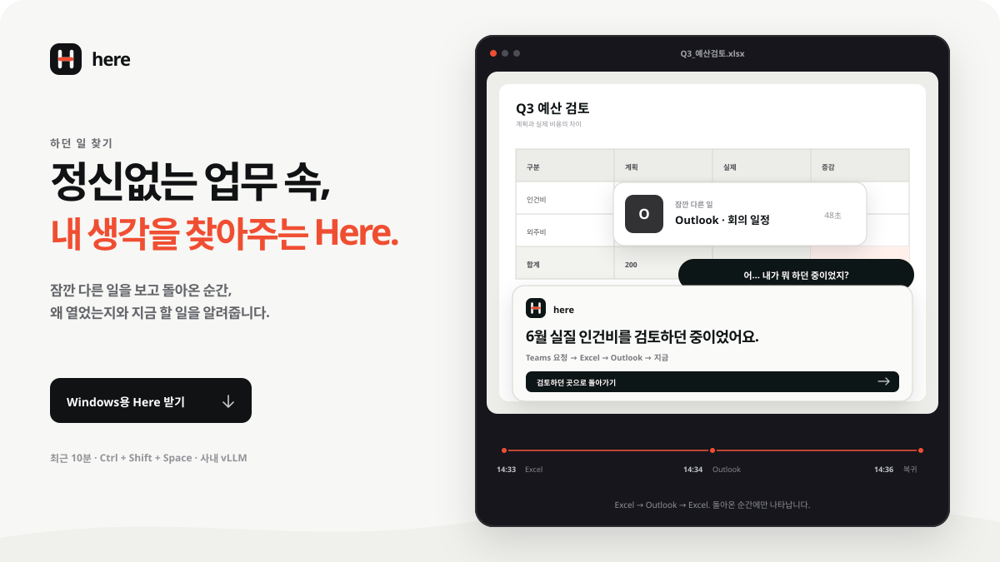

<p align="center">
  <a href="https://stpcoder.github.io/here-context-recall/">
    
  </a>
</p>

<h1 align="center">Here</h1>

<p align="center">
  <strong>다시 돌아온 창에서, 이유도 함께.</strong><br />
  잠깐 다른 일을 보고 돌아온 순간, 왜 열었는지와 다음 한 단계를 복원합니다.
</p>

<p align="center">
  <a href="https://github.com/stpcoder/here-context-recall/actions/workflows/build-desktop.yml"></a>
  <a href="https://github.com/stpcoder/here-context-recall/actions/workflows/deploy-site.yml"></a>
  <a href="https://github.com/stpcoder/here-context-recall/releases/tag/latest-build"></a>
</p>

<p align="center">
  <a href="https://stpcoder.github.io/here-context-recall/"><strong>제품 보기</strong></a>
  &nbsp;&nbsp;·&nbsp;&nbsp;
  <a href="https://github.com/stpcoder/here-context-recall/releases/download/latest-build/Here-Windows-x64-Setup.exe"><strong>Windows용 다운로드</strong></a>
  &nbsp;&nbsp;·&nbsp;&nbsp;
  <a href="https://stpcoder.github.io/here-context-recall/manual/"><strong>사용 안내</strong></a>
</p>

<p align="center">
  <a href="https://stpcoder.github.io/here-context-recall/">
    
  </a>
</p>

## 업무가 끊기는 한 순간을 해결합니다

Teams 요청을 보고 Excel을 열었습니다. 회의 알림 때문에 Outlook을 잠깐 확인했습니다. 다시 Excel로 돌아왔는데, 방금 보려던 숫자가 기억나지 않습니다.

Here는 그 순간 `Ctrl + Shift + Space` 한 번으로 최근 창 흐름을 되짚습니다.

```text
14:31  Teams       “Q3 예산안 숫자 확인 부탁드립니다”
14:32  Explorer    3분기 보고 폴더
14:33  Excel       Q3_예산검토.xlsx
14:34  Outlook     회의 일정 확인          ← 잠깐의 인터럽션
14:36  Excel       Q3_예산검토.xlsx        ← 지금

→ “비용 증감 합계를 확인하던 중이었어요.”
```

| 처음 요청 | 잠깐의 이탈 | 다음 한 단계 |
| --- | --- | --- |
| 어디서 시작됐는지 | 무엇이 흐름을 끊었는지 | 지금 어디서 이어갈지 |

## 다운로드

| 플랫폼 | 다운로드 | 상태 |
| --- | --- | --- |
| **Windows x64** | **[설치본 받기](https://github.com/stpcoder/here-context-recall/releases/download/latest-build/Here-Windows-x64-Setup.exe)** · [Portable](https://github.com/stpcoder/here-context-recall/releases/download/latest-build/Here-Windows-x64-Portable.exe) | 주 지원 |
| **macOS Apple Silicon** | **[DMG 받기](https://github.com/stpcoder/here-context-recall/releases/download/latest-build/Here-macOS-arm64.dmg)** | 보조 지원 |

다운로드 주소는 고정입니다. `main` 빌드가 통과할 때마다 최신 설치 파일과 [SHA-256 체크섬](https://github.com/stpcoder/here-context-recall/releases/download/latest-build/SHA256SUMS.txt)이 자동으로 교체됩니다. 현재 해커톤 빌드는 코드 서명이 없어 OS 보안 확인이 나타날 수 있습니다.

## 제품 원칙

### 흐름은 로컬에서 먼저 판단합니다

활성 앱, 창 제목, 전환 시각을 최근 10분 동안 메모리에 보관합니다. `요청 → 파일 → 인터럽션 → 복귀`의 근거를 로컬 규칙으로 좁힌 뒤, 최대 5개 이벤트만 설명 단계에 사용합니다.

### 회사의 AI를 그대로 연결합니다

Here는 OpenAI-compatible API를 제품의 기본 연결 방식으로 사용합니다. vLLM, 사내 gateway 또는 호환 endpoint에 세 값만 입력하면 됩니다.

```text
Base URL     https://llm.company.internal/v1
Model ID     Qwen/Qwen2.5-72B-Instruct
Bearer token ••••••••••••
```

- `/chat/completions`와 Here JSON 응답 계약을 실제 요청으로 검증합니다.
- JSON Schema 미지원 서버는 `json_object`와 prompt-only JSON으로 자동 호환됩니다.
- 모델 호출이 실패하거나 예산을 넘으면 관측된 로컬 결과로 즉시 돌아갑니다.
- token은 renderer나 브라우저 저장소가 아닌 OS 보호 저장소에 암호화됩니다.

[vLLM/OpenAI-compatible 연결 가이드 →](VLLM.md)

### 업무 내용이 아니라 흐름만 기록합니다

| 기록 | 기록하지 않음 | 사용자 제어 |
| --- | --- | --- |
| 앱 · 창 제목 · 전환 시각 | 키 입력 · 클릭 · 클립보드 | 동의 후 시작 |
| 프로세스 · 창 위치와 크기 | 파일 본문 · 셀 값 · URL | 일시 정지 · 앱 제외 |
| 최근 10분 메모리 | 상시 스크린샷 | 보존 시간 변경 · 즉시 삭제 |

화면 이미지는 기본으로 꺼져 있습니다. 별도 옵션을 켜고 사용자가 직접 복원 또는 체크포인트를 실행한 순간에만 활성 창 한 장을 사용합니다.

## 작동 구조

```text
Windows foreground window
        ↓
10분 in-memory activity monitor
        ↓
deterministic causal chain
        ↓
optional OpenAI-compatible / vLLM summary
        ↓
Here recall panel
```

LLM은 작업 경계를 새로 만들지 않습니다. 사람의 Pause/Resume, 동일 창 복귀, 비활성 구간을 로컬 규칙으로 먼저 판단하고 모델은 선정된 근거만 한 문장으로 정리합니다. 세부 수집·작업 경계·호출 예산은 [CAPTURE.md](CAPTURE.md)에 공개되어 있습니다.

<details>
<summary><strong>개발과 검증</strong></summary>

Node.js 22 LTS를 권장합니다.

```bash
npm ci
npm run dev

# 제품 사이트
npm run site:dev

# 전체 검증
npm run typecheck
npm test
npm run build
npm run site:build
```

| Git 작업 | 자동 결과 |
| --- | --- |
| Pull request | Windows·macOS 테스트와 패키징 검증 |
| `main` push | `latest-build` 설치 파일 교체 + 제품 사이트 배포 |
| `v*` 태그 push | 버전별 GitHub Release + 설치 파일 + 체크섬 |

Electron renderer에는 Node 권한이 없습니다. endpoint 요청, API key 복호화, 모델 응답의 evidence ID 검증은 메인 프로세스에서만 수행합니다.

</details>

## 문서

- [제품 사이트](https://stpcoder.github.io/here-context-recall/)
- [사용 안내](https://stpcoder.github.io/here-context-recall/manual/)
- [vLLM/OpenAI-compatible 연동](VLLM.md)
- [Windows 수집·작업 경계·호출 예산](CAPTURE.md)
- [해커톤 데모](HACKATHON.md)
- [최신 자동 빌드](https://github.com/stpcoder/here-context-recall/releases/tag/latest-build)

---

<p align="center"><strong>잊어도, 일은 끊기지 않게.</strong></p>
