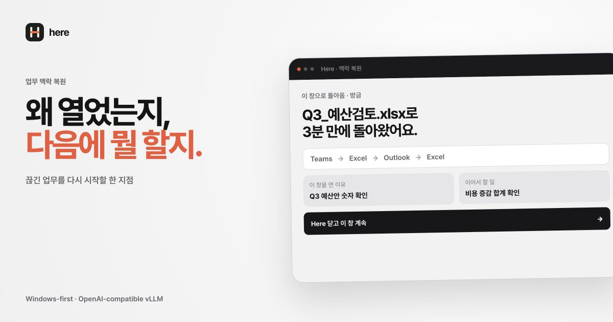
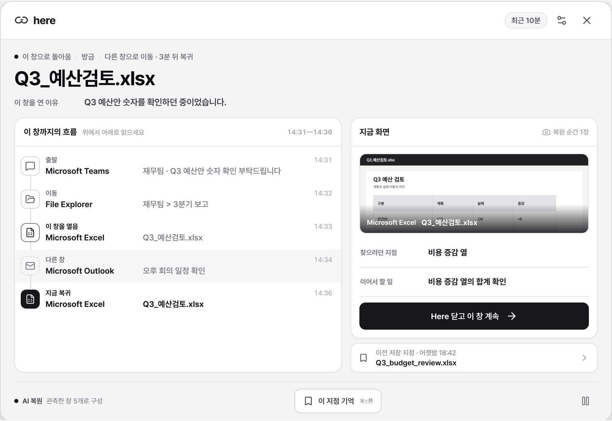

<p align="center">
  <a href="https://stpcoder.github.io/here-context-recall/">
    
  </a>
</p>

<h1 align="center">Here</h1>

<p align="center">
  <strong>왜 열었는지, 다음에 뭘 할지.</strong><br />
  현재 창을 열기 전부터 다른 창을 거쳐 돌아온 순간까지, 시간순으로 되찾습니다.
</p>

<p align="center">
  <a href="https://github.com/stpcoder/here-context-recall/actions/workflows/build-desktop.yml"></a>
  <a href="https://github.com/stpcoder/here-context-recall/actions/workflows/deploy-site.yml"></a>
  <a href="https://github.com/stpcoder/here-context-recall/releases/tag/latest-build"></a>
</p>

<p align="center">
  <a href="https://stpcoder.github.io/here-context-recall/"><strong>제품 보기</strong></a>
  &nbsp;·&nbsp;
  <a href="https://stpcoder.github.io/here-context-recall/manual/"><strong>빠른 시작</strong></a>
  &nbsp;·&nbsp;
  <a href="https://github.com/stpcoder/here-context-recall/releases/tag/latest-build"><strong>모든 다운로드</strong></a>
</p>

## 지금 받기

| 플랫폼 | 권장 다운로드 | 다른 방식 |
| --- | --- | --- |
| Windows x64 | **[설치본 받기](https://github.com/stpcoder/here-context-recall/releases/download/latest-build/Here-Windows-x64-Setup.exe)** | [Portable](https://github.com/stpcoder/here-context-recall/releases/download/latest-build/Here-Windows-x64-Portable.exe) |
| macOS Apple Silicon | **[DMG 받기](https://github.com/stpcoder/here-context-recall/releases/download/latest-build/Here-macOS-arm64.dmg)** | 보조 지원 |

위 주소는 바뀌지 않습니다. `main` 빌드가 통과할 때마다 새 파일로 자동 교체되며, [SHA-256 체크섬](https://github.com/stpcoder/here-context-recall/releases/download/latest-build/SHA256SUMS.txt)도 함께 갱신됩니다. 현재 해커톤 빌드는 배포용 코드 서명이 없어 Windows SmartScreen 또는 macOS Gatekeeper 확인이 나타날 수 있습니다.

## 60초 시작

1. Here를 설치하고 **창 흐름 허용**을 켭니다.
2. 평소처럼 메신저, 브라우저, 문서 창을 오갑니다.
3. “내가 이걸 왜 열었지?” 싶은 순간 `Ctrl + Shift + Space`를 누릅니다.
4. 이 창을 열기 전, 처음 연 순간, 다른 창, 지금 복귀 순서로 확인합니다.

macOS 단축키는 `Command + Shift + Space`입니다. 몇 시간 뒤나 다음 날 이어야 할 지점은 `Ctrl + Shift + M`으로 **여기 기억**에 남길 수 있습니다.

<p align="center">
  
</p>

| 열기 전 | 이 창을 처음 열음 | 이 창을 벗어난 동안 | 지금 복귀 |
| --- | --- | --- | --- |
| Teams · Q3 예산 요청 | Excel · Q3_예산검토.xlsx | Outlook · 회의 일정 | Excel · 비용 증감 확인 |

창 목록을 임의로 분류하지 않습니다. 실제로 관측한 흐름을 위에서 아래로 읽으면 현재 창의 이유와 다음 행동이 함께 보입니다.

## 사내 AI 연결

Here는 로컬 근거 체인만으로도 동작합니다. 사내 OpenAI-compatible 또는 vLLM endpoint를 연결하면 같은 근거를 더 자연스러운 한 문장으로 정리합니다.

설정의 **Work AI**에 세 값만 넣으면 됩니다.

```text
Base URL     https://llm.company.internal/v1
Model ID     Qwen/Qwen2.5-72B-Instruct
Bearer token ••••••••••••
```

- 연결 확인은 선택한 모델로 실제 `POST /chat/completions`와 Here JSON 계약까지 검증합니다.
- JSON Schema를 지원하지 않는 서버는 `json_object`, prompt-only JSON 순서로 자동 재시도합니다.
- 로컬 무인증 vLLM은 token을 비워 둘 수 있습니다.
- 모델 호출이 실패해도 관측된 로컬 결과는 즉시 유지됩니다.
- token은 renderer나 브라우저 저장소에 두지 않고 OS 보호 저장소에 암호화합니다.

사내 gateway, 인증, 모델 호환성 점검은 [VLLM 연동 가이드](VLLM.md)에 정리했습니다. Vertex AI는 로컬 macOS QA를 위한 선택지이며 제품의 기본 배포 경로는 OpenAI-compatible/vLLM입니다.

## 필요한 것만 기록합니다

| 기록 | 기록하지 않음 | 사용자가 제어 |
| --- | --- | --- |
| 활성 앱, 창 제목, 전환 시각 | 키 입력, 클릭, 클립보드 | 동의 후 시작 |
| 프로세스, 창 위치·크기 | 파일 본문, 셀 값, URL | 일시 정지, 앱 제외 |
| 기본 10분 메모리 보관 | 상시 스크린샷 | 보존 시간 변경, 즉시 삭제 |

화면 이미지는 기본으로 꺼져 있습니다. 사용자가 별도 옵션을 켜고 **왜 여기지?** 또는 **여기 기억**을 직접 실행한 순간에만 활성 창 한 장을 사용합니다. 자동 타임라인은 앱 종료 시 사라지고, 사용자가 만든 체크포인트만 OS 보호 저장소로 암호화해 최대 12개·7일 보관합니다.

## 자동 빌드와 버전

| Git 작업 | 자동 결과 |
| --- | --- |
| Pull request | Windows·macOS 테스트와 패키징 검증 |
| `main` push | `latest-build` 설치 파일 자동 교체 + 제품 사이트 배포 |
| `v*` 태그 push | 해당 버전의 GitHub Release + 설치 파일 + 체크섬 생성 |

따라서 사용자는 README의 고정 버튼으로 항상 최신 성공 빌드를 받고, 팀은 `v0.2.0` 같은 태그별 산출물을 별도로 보관할 수 있습니다. 실패한 빌드는 다운로드 파일을 교체하지 않습니다.

## 개발

Node.js 22 LTS를 권장합니다.

```bash
npm ci
npm run dev

# 제품 사이트
npm run site:dev

# 검증
npm run typecheck
npm test
npm run build
npm run site:build
```

<details>
<summary><strong>패키징 명령</strong></summary>

```bash
npm run dist:win           # Windows NSIS + portable
npm run dist:win:portable  # Windows portable only
npm run dist:mac           # macOS arm64 DMG
```

산출물은 `release/<version>/`에 생성됩니다. Windows 설치 검증은 GitHub Actions의 Windows runner를 기준으로 합니다.
</details>

<details>
<summary><strong>구조와 보안 경계</strong></summary>

```text
foreground window reader
  → 10분 in-memory activity monitor
  → deterministic causal chain
  → optional encrypted checkpoint
  → optional OpenAI-compatible/vLLM reconstruction
  → secure preload bridge
  → bubble / recall panel / tray
```

Electron renderer에는 Node 권한이 없습니다. 네트워크 호출, API key 복호화, 모델 응답의 evidence ID 검증은 메인 프로세스에서만 수행합니다. `A → 다른 앱 → A`가 실제로 관측된 경우에만 복귀·방해 흐름으로 표시합니다.
</details>

## 더 보기

- [빠른 시작 가이드](https://stpcoder.github.io/here-context-recall/manual/)
- [vLLM/OpenAI-compatible 운영 가이드](VLLM.md)
- [해커톤 데모와 제출 문구](HACKATHON.md)
- [최신 자동 빌드](https://github.com/stpcoder/here-context-recall/releases/tag/latest-build)

---

<p align="center"><strong>잊어도, 일은 끊기지 않게.</strong></p>
